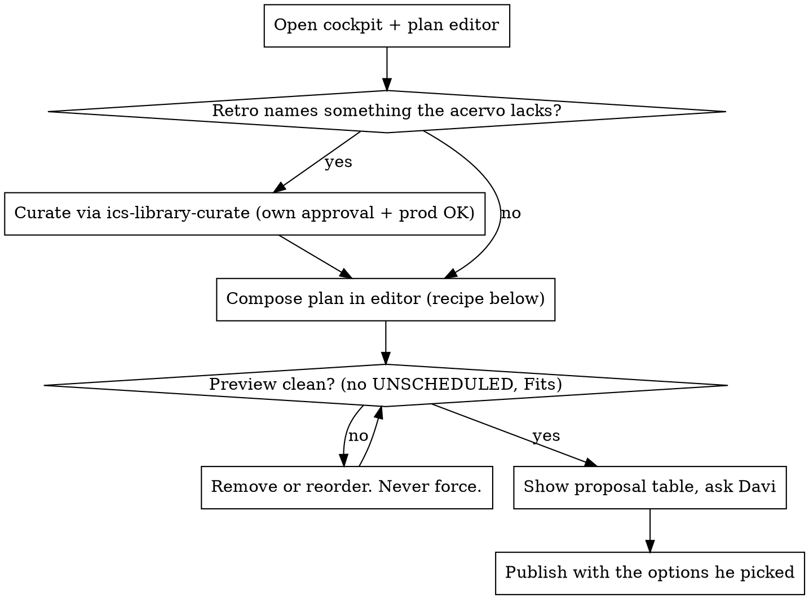

# Planning and publishing a member's week

## Overview

A weekly plan is the admin's written answer to one member's last retro, sized to the time
that member actually has. Publishing it creates Google Calendar events and sends a WhatsApp
to a real person. So the job has three fixed parts: read what the member said and did,
compose a plan that fits, and show it to Davi before anything reaches the member.

Everything runs in the **production admin UI through claude-in-chrome** (`ics.daviduarte.com.br`).
Plans are never written through psql, Prisma, or the API from the laptop. Login is Davi's:
if `/admin/*` redirects to `/login`, stop and ask him to sign in on the tab you opened.

**The facts about the scheduler, the editor, and the picker are in this file.** Do not
re-derive them from `apps/api/src/scheduler`, `publication.service.ts`, or the editor
components. Two baseline runs spent 150k and 200k tokens reading that code to learn what
the tables below say. If a fact you need is missing here, ask Davi or add it after
verifying; don't go spelunking mid-plan.

## When NOT to use

- Davi wants to change one item on an already PUBLISHED plan → use the editor's
  "Apply changes" directly, no skill.
- Davi is asking about the acervo, not a member → `ics-library-curate`.
- The task is a class, not a study plan → `picking-class-topic-from-tech-blog`.

## The loop, per member



## 1. Read (all of it, every time)

| Where | What to take |
|---|---|
| `/admin/members` → member | Cockpit: track, week N of M, engagement score + chip (`ON TRACK` / `AT RISK`), items done / planned, days active, `Hours per week · target`. |
| Cockpit → **Plan week** | Dialog offers *Current week* and *Next week*, each labelled `Edit existing plan · DRAFT` / `Create new plan` / published. Pick per §2. |
| Editor, right panel | **Last week · outcomes**, **Carry-over candidates** (pre-checked), **Retro** (`What clicked` + `Next week wish`, verbatim), **Topic coverage · all time**. |
| Editor, header line | `N items · X min (Y raw) · Planned X / BUDGET min · Fits remaining / Tight · headroom · days left`. |
| Editor, **Semana · preview** (scroll down) | Per day: `cap`, availability window, `⊘ busy` blocks from Google Calendar, where each item lands, and an **UNSCHEDULED** section if something doesn't fit. This is the only truth about capacity. |

The retro's `Next week wish` is the theme of the week when it exists. Read it as the member
wrote it, not as a topic slug: "case da BCG sobre rota de entregas" is graphs applied to
logistics plus how to answer a consulting case, not "graph 0/12".

Facts that decide capacity, read from the preview and never assumed:

- **Daily cap is a hard ceiling per day.** A 60-min cap holds two 30-min blocks or four 15s.
  A member's weekly budget can be larger than the sum of caps that remain this week.
- **Days already past don't count.** On Wednesday, Monday and Tuesday windows are gone;
  the header's `days left` and the preview's `passou · slots no passado` say so.
- **Items must fit a contiguous slot inside one day's window.** `0 min headroom` in the
  header can still leave an item UNSCHEDULED in the preview.

## 2. Which week

- **Mon–Wed:** the current week, unless it is already PUBLISHED; then next week.
- **Thu–Sun:** next week. The current week is what it is.
- Davi naming a week ("essa semana", "semana que vem") overrides both.

## 3. Compose (the recipe)

Build the plan in this order in the editor. The plan IS this list; nothing else goes in.

1. **Carry-overs, one decision each.**
   - `STUCK` item → do not re-assign it as-is. Either remove it and add a different-format
     item on the same topic (other channel, easier tier, book chapter, AlgoViz) or keep it
     *after* such an item. "Rever o mesmo vídeo que travou" is not a plan.
   - `PENDING` item → keep if it belongs to this week's theme or finishes a topic the
     member is one item away from; otherwise remove. Removed items do not come back
     automatically next week (carry-over only looks at last week's published plan); say so
     in the admin notes.
   - The checkbox in **Carry-over candidates** does not remove the row from the draft. It
     only feeds "Sugerir com IA" and the picker's marks. Rows leave the plan through the
     `×` on the row itself.
2. **The theme from the retro.** If the wish names a topic: filter the picker by that topic
   (the `All topics` dropdown) and add items in the ladder order the picker already shows
   (`Topic.order` → per-topic `order` → difficulty). Start with the EASY entry if coverage
   is `0/N`. If the wish names something the picker has nothing for, go to §4 first, then
   come back here.
3. **Size to the member, not to the budget.**
   - `AT RISK` chip, engagement < 40, or a retro that says "menos coisa" / "travada" →
     **3 to 4 items, one per session, ≤ 50% of budget.** Finishing 3/3 beats 5/8.
   - Median member → 60–80% of budget.
   - Top of cohort with everything done → fill to `Fits remaining`, keep ≥ 15 min headroom.
4. **Order:** carry-overs first, then the theme's ladder, practice/labs/LeetCode after the
   concept they exercise. Order is a hard constraint for the scheduler: item 3 never lands
   before item 2.
5. **Only items visible in the picker.** The picker hides what the member already finished
   (`DONE_EASY`, `DONE_HARD`, `SKIPPED`) and items whose `tracks` exclude the member's
   track. If a topic the retro asks for shows 0 items for this member but exists for others,
   that is a `tracks` gap: **report it to Davi in the proposal, do not retag the seed on
   your own.**

Planned minutes the header will show per item (`allocatedMinutes` in
`packages/shared/src/domain/scheduling.ts`, verified 2026-09-16):

```
effective = VIDEO ? raw × 2 : raw
planned   = max(15, ceil((effective − 3) / 15) × 15)
```

| Raw | VIDEO | ARTICLE / BOOK / PROBLEM |
|---|---|---|
| 4–9 | 15 | 15 |
| 11 | 30 | 15 |
| 15 | 30 | 15 |
| 22 | 45 | 30 |
| 25 | 60 | 30 |
| 28 | 60 | 30 |
| 37 | 75 | 45 |
| 47 | 105 | 45 |
| 50 | 105 | 60 |

Between blocks in the same window the scheduler leaves ~10 min. Two 30s and a 15 fill a
90-min window; they do not fill a 60.

## 4. When the retro asks for something the acervo lacks

Curate it now, in the same session, through `ics-library-curate`, and only then finish the
plan. That skill's gates stay: WebSearch for real URLs, exact YouTube durations via curl,
proposal table, Davi approves items, seed runs local, **separate "pode rodar contra prod"**,
commit `--only` the seed. Items appear in the picker as soon as the prod seed finishes;
re-open **Add from library** to see them.

Two rules specific to this loop:

- **Search before asking.** Run the WebSearch and the duration scrapes on your own; Davi
  approves items, not search terms. Then propose the curation table and the plan proposal
  together, so he answers once. If the curation needs its own back-and-forth, do it first;
  the plan waits.
- Scope the curation to what the member asked plus the EASY entry that makes it usable.
  A retro is not a mandate to build a 13-item topic; that only happens when Davi says so
  ("adiciona os materiais que você recomendou").

Writing the missing material into a WhatsApp text instead of the acervo is not a
substitute. The text can be offered *in addition* (see §7), never instead.

## 5. Preview, then propose

Before proposing, scroll to **Semana · preview** and check: every item has a day and time,
no **UNSCHEDULED** section, header says `Fits remaining`. If not, remove the last-added
item or move a long one to a day with a bigger window. **"Forçar publicação" is not an
option this skill uses**: force swaps the member's declared availability for 08:00–22:00
every day with no cap (`FORCE_FALLBACK_SLOTS`), so the Calendar fills hours the member
never offered.

Then write the proposal in chat:

```
**<Name> — semana N (<dates>), <items> itens, <planned>/<budget> min**

| # | Item | Fmt | min | Por quê |
|---|---|---|---|---|
| 1 | ... | VIDEO | 28 | carry-over, STUCK → vem depois do capítulo |
...

Ficou de fora: <item> (não cabe no cap de sáb) · <item> (mesmo vídeo que travou)
Para a semana N+1: ...
Gap encontrado: <topic> tem 0 itens visíveis pra <TRACK> (tracks do seed). Quer que eu abra?
```

Then one `AskUserQuestion` per member (batch up to 4 members in one call):

- **Publish now, Calendar + WhatsApp** — for the current week.
- **Scheduled Mon 07:00, Calendar + WhatsApp** — for next week (the dialog's default).
- **Só Calendar** — no WhatsApp.
- **Salvar draft** — he reviews later.

The gate does not move for "rápido", "tenho que sair", "publica direto", or a member being
top of the cohort. A publish is a message to the member; Davi sends messages, not the agent.
If he pre-authorized in this conversation with those exact words ("pode publicar sem me
perguntar"), that holds for this session only.

## 6. Publish

Editor → **Publish…** → dialog:

- **When:** `Publish now` for the current week (the default `Scheduled` is pre-filled with
  this Monday 07:00, already in the past). `Scheduled` + Monday 07:00 for next week: the
  plan stays DRAFT-like and editable over the weekend, and Calendar + WhatsApp fire Monday
  morning via cron.
- **Create Google Calendar events** and **Send WhatsApp notification to member** exactly as
  Davi chose.
- Wait for `Plano publicado · N sessões no calendário`, click **Concluir**. Report the
  per-item day/time the dialog shows.

Admin notes (`Admin notes · private`, plain text, pt-BR, 2–4 lines) go in before publishing:

```
Semana N. Retrô pediu <X>. Plano: <por que esses itens nesta ordem>.
Tirei <item> (<motivo>). Fica pra semana N+1: <itens>.
<Se AT RISK:> Meta é fechar N/N; se fechar, semana N+1 volta <tema>.
```

## 7. Optional: a WhatsApp text for Davi to send himself

When the plan is a direct answer to a retro wish, offer 3–6 lines in Davi's voice
(pt-BR, no em dashes, no emojis) that he can paste. The platform's own template only
carries the first name. Offer it after the publish confirmation, not as a way to skip §4.

## Red flags

| Thought | Reality |
|---|---|
| "He said rápido, I'll publish and tell him" | The gate is the deliverable. Propose, ask, publish. |
| "The budget is 300, Saturday must be 120" | The preview shows the cap. Plan to the cap. |
| "I'll add the framework in a WhatsApp since the acervo lacks it" | Curate it (§4). The text is extra, not instead. |
| "graph is hidden for CONSULTING_TECH, I'll add the track in the seed" | Report the gap. Davi decides taxonomy. |
| "Let me read phase1.ts to see how padding works" | The table in §3. Ask if it's missing. |
| "I remember Grokking has a recursion chapter" | Only what the picker shows. Type it in the search. |
| "Unchecking the carry-over removed it" | It didn't. Use `×` on the row. |
| "0 headroom, fits" | Scroll to the preview. UNSCHEDULED is the verdict. |
| "The member is rank 1, no need to ask" | Ask. |

## Common mistakes

- Re-assigning a STUCK video unchanged because it was pre-checked.
- Filling to `Fits remaining` for an `AT RISK` member whose retro said "menos coisa".
- Planning the current week on a Friday night: two days of windows are already gone.
- Proposing before scrolling to the preview, then publishing with an UNSCHEDULED item.
- Curating a whole topic when the retro asked for one thing.
- Guessing `estimatedMinutes` or a video URL during the curation branch; `ics-library-curate`
  requires the scrape.
- Writing to the DB or calling the API from the laptop to "speed up" plan creation.
