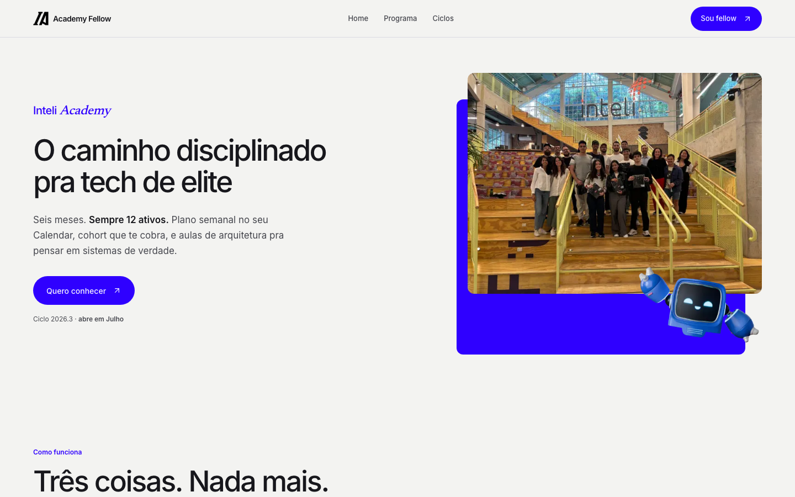
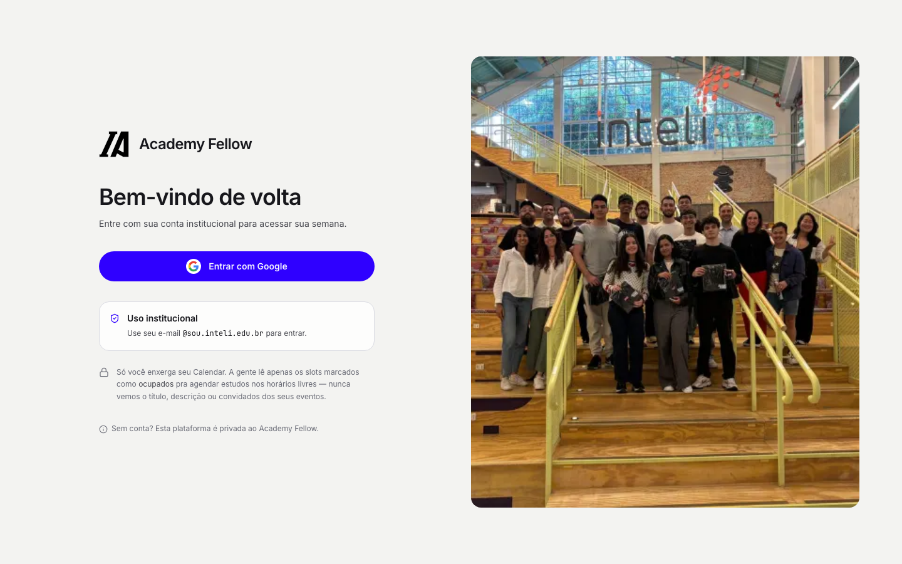
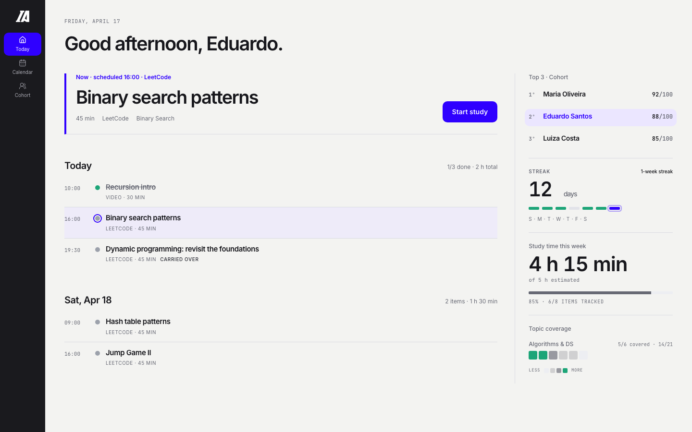

# Academy Fellow

Programa de desenvolvimento técnico do **Inteli Academy** para quem quer chegar mais preparado a entrevistas, competições e desafios reais de engenharia de software.

São seis meses com uma cohort de 12 fellows ativos. Cada pessoa recebe um plano semanal individual, construído a partir de um acervo curado e organizado diretamente no Google Calendar. O Studio transforma esse plano em uma rotina clara: o que estudar agora, como a semana está avançando e onde agir quando algo trava.

🔗 **[ics.daviduarte.com.br](https://ics.daviduarte.com.br)**



---

## O programa

Preparação técnica costuma virar uma trilha genérica que ninguém termina ou uma lista de links que deixa toda a decisão para o aluno. O Academy Fellow trabalha com três restrições deliberadas:

**O plano é individual e tem revisão humana.** Toda semana, a liderança educacional monta o plano de cada fellow olhando o histórico, os pontos de dificuldade, os objetivos e o tempo disponível. Ao abrir o Studio, a próxima ação já está definida.

**A cohort é pequena e visível.** São 12 pessoas por vez. Progresso, streak e engajamento ficam visíveis para que ninguém desapareça na multidão e para que a evolução seja também coletiva.

**A prática aponta para desafios reais.** O programa atende tracks de Big Tech, consulting tech, programação competitiva, startups e objetivos personalizados. O acervo combina algoritmos, estruturas de dados, arquitetura de sistemas e materiais de engenharia selecionados pela equipe.

Ao final de cada ciclo, a atividade da cohort é revista. Fellows seguem para o próximo ciclo de acordo com seu envolvimento, enquanto novas pessoas podem entrar pela lista de espera.

## Entrada simples e institucional

O acesso acontece com a conta institucional do Inteli. A integração com o Google Calendar lê somente os horários marcados como ocupados e cria as sessões de estudo nos intervalos disponíveis.



## O Studio do Fellow



O **Today** é a superfície principal: destaca o estudo atual, ordena o restante do dia e mantém cohort, streak, tempo de estudo e cobertura de tópicos no mesmo contexto. A navegação também reúne:

- **Calendar**, para visualizar a semana e os blocos criados pelo programa;
- **Cohort**, para acompanhar a evolução do grupo;
- **Retro**, para refletir sobre a semana e registrar impedimentos;
- **Settings**, para ajustar perfil, disponibilidade e aparência.

Quando um plano é publicado, o **scheduler** divide cada item em sessões compatíveis com a disponibilidade semanal e cria os eventos no Google Calendar. A ordem pedagógica definida pela liderança é uma restrição forte: o sistema prefere preservar a sequência a encaixar um item posterior em uma brecha anterior.

Ao concluir um item, o fellow registra um dos seis **outcomes** em um fluxo guiado, com uma decisão por vez:

| Outcome | Significado |
|---|---|
| `DONE_EASY` | Concluiu com tranquilidade |
| `DONE_HARD` | Concluiu, mas encontrou dificuldade |
| `DOUBTS` | Concluiu e quer revisitar o assunto |
| `STUCK` | Travou e precisa de apoio |
| `SKIPPED` | Pulou porque já dominava o conteúdo |
| `PENDING` | Ainda não concluiu |

`DONE_HARD` e `DOUBTS` contam como conclusão, mas influenciam o plano seguinte de forma diferente de `DONE_EASY`. Itens `PENDING` e `STUCK` retornam automaticamente como carry-over e permanecem em destaque até serem resolvidos.

## A operação educacional

A equipe do Academy acompanha o programa por um cockpit administrativo com visão por fellow e por ciclo.

**Editor de plano.** Organiza a semana com itens do acervo e mostra, no mesmo espaço, histórico de outcomes, cobertura por tópico, disponibilidade e carry-overs.

**Acervo.** Mantém materiais com busca lexical, tópicos primários e secundários, dificuldade e uma ordem pedagógica independente da fonte.

**Engajamento.** Consolida dias ativos, conclusão dos planos, retros, presença, posição na cohort e recência. A mesma regra alimenta as visões do admin e do fellow.

**Aulas de arquitetura.** Abrem sistemas reais — como encurtadores de URL, mapas em tempo real, ledgers e arquiteturas orientadas a eventos — para discutir requisitos, escala e trade-offs.

**IA como assistente.** O `gpt-5.4-mini` apoia rascunhos de plano, estruturação de briefs, diagnósticos e chat contextual. Toda geração registra tokens e custo; a decisão final continua com a equipe educacional.

## Stack

Monorepo com pnpm 9, Turborepo 2 e Node 20.

| Workspace | Tecnologias e responsabilidade |
|---|---|
| `apps/web` | Next.js 15, React 19, HeroUI, Tailwind CSS, Framer Motion, TanStack Query e Lucide |
| `apps/api` | NestJS 10, Prisma 5, PostgreSQL 16 + pgvector, Google OAuth, JWT rotativo e criptografia AES-256-GCM |
| `packages/prisma` | Schema, migrations e client do Prisma; busca textual e vetores complementados por SQL |
| `packages/shared` | Contratos e regras de domínio compartilhados entre API e web |

O nome público é **Academy Fellow**. Os nomes internos `ics-select` e `@ics-select/*` permanecem no código para preservar compatibilidade com os workspaces e a infraestrutura existentes.

### Identidade visual

A interface parte da marca do Inteli Academy e combina superfícies neutras frias com o azul do Academy. **Inter** conduz a interface, **Newsreader** aparece em momentos editoriais e **JetBrains Mono** organiza datas, métricas e identificadores.

O Studio usa um canvas aberto com rail persistente, hierarquia tipográfica forte e divisores leves. Cores adicionais indicam outcomes e estados de sistema. A experiência inclui temas claro e escuro, foco visível, alvos de toque de pelo menos 44 px e movimento reduzido quando solicitado pelo sistema operacional.

## Rodando localmente

Você precisa de Node 20, pnpm 9 e Docker.

```bash
# 1. Instalar dependências
pnpm install

# 2. Subir o PostgreSQL 16 com pgvector
cp .env.example .env
docker compose up -d postgres

# 3. Aplicar migrations
pnpm db:deploy

# 4. Configurar API e web
cp apps/api/.env.example apps/api/.env
cp apps/web/.env.example apps/web/.env.local

# 5. Subir os workspaces
pnpm dev
```

- Web: [http://localhost:3000](http://localhost:3000)
- API: [http://localhost:3001/health](http://localhost:3001/health)

Sem `GOOGLE_OAUTH_*`, o login institucional fica indisponível. Sem `OPENAI_API_KEY`, os recursos de IA ficam fora do ar; o restante da aplicação continua funcionando.

### Comandos

```bash
pnpm lint          # lint em todos os workspaces
pnpm typecheck     # typecheck em todos os workspaces
pnpm test          # Jest, Vitest e Playwright
pnpm build         # build completo
pnpm db:migrate    # cria e aplica uma migration local
pnpm db:generate   # regenera o client do Prisma
pnpm db:deploy     # aplica migrations existentes
```

Para executar um teste específico:

```bash
pnpm --filter @ics-select/api test -- --testPathPattern library.service
pnpm --filter @ics-select/web test tests/member-studio.spec.ts
```

## Deploy

O frontend roda na Vercel e acompanha a branch `main`. A API roda em container no EasyPanel:

1. o workflow **CI** valida migrations, tipos, lint, testes e build;
2. o workflow **Deploy** publica a imagem `ghcr.io/yuhtin/ics-select-api` com as tags do commit e `latest`;
3. o EasyPanel recebe o gatilho, baixa a imagem e reinicia a API;
4. o entrypoint executa `prisma migrate deploy` antes de iniciar o servidor.

O endpoint público de saúde é [`https://ics-api.daviduarte.com.br/health`](https://ics-api.daviduarte.com.br/health).

## Sobre este repositório

O Academy Fellow roda em produção com dados reais de fellows. O código está público porque as decisões de produto e arquitetura podem ser úteis para outras iniciativas, mas o repositório não foi preparado como uma distribuição genérica: ele depende de um projeto no Google Cloud, uma chave da OpenAI e infraestrutura configurada.

Issues com dúvidas são bem-vindas. O roadmap acompanha as necessidades da cohort e da operação do Inteli Academy.
