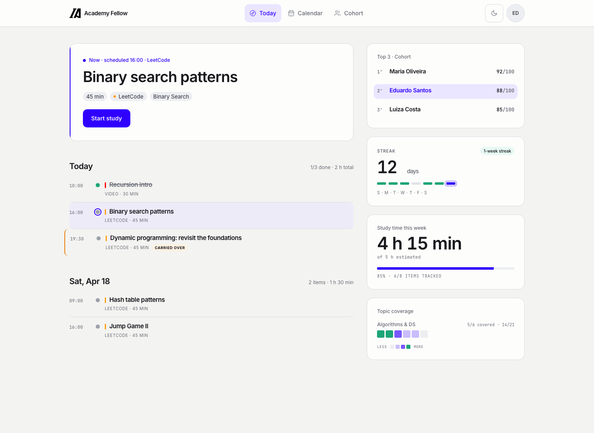

# ICS Select

A private platform that helps the **Inteli Consulting Society** prepare a small cohort of students for top-tier tech interviews. One educational director, twelve members per cycle, personalized weekly plans, six discrete outcomes per item, an AI layer that turns judgment into leverage.

> **Full documentation: [ics-docs.daviduarte.com.br](https://ics-docs.daviduarte.com.br)**



## Why it exists

A traditional interview-prep program either picks one curriculum and runs everyone through it (under-serves the strongest, over-serves the weakest), or it stays small and artisanal (a single director cannot build twelve bespoke plans per week). ICS Select absorbs the work around the director's judgment, library curation, plan scheduling, outcome tracking, cohort surfacing, so the director's time goes to the calls that actually matter.

Cohort members range from ICPC grinders to Stripe-bound product engineers to consulting-tech candidates. The `Track` enum on `User` (`BIG_TECH | CONSULTING_TECH | COMPETITIVE_PROGRAMMING | STARTUP | OTHER`) is the canonical scope. The platform never reduces itself to "Big Tech only".

## How it works

- A curated **library** of materials (videos, articles, books, Leetcode), organized by topic with a deliberate EASY → MEDIUM → HARD ladder per topic.
- A weekly **plan editor** with AI-assisted drafts (OpenAI `gpt-5.4-mini`), carry-over candidates from the previous week, and a scheduler that packs items onto the member's Google Calendar against declared weekly availability.
- Six **outcomes** per item (`nailed it`, `got it hard`, `had doubts`, `stuck`, `skipped because I already knew it`, `not yet`). Four of them count as positive; only `not yet` and `stuck` carry over.
- An **engagement score** (six criteria summing to 100) that is the single source of truth for both the admin cockpit and the member-facing cohort ranking.
- A streaming **AI chat** that loads each member's full history as context, so the director can ask "why is this student stuck on graphs" with one click.
- A **Magazine Editorial** visual identity: dual serif (Newsreader for narrative, Source Serif 4 for dense data), terracotta and indigo accents earned by meaning, no decorative color, no shadows.

The full product tour, architecture, and deploy story live in the docs site under `apps/docs/`.

## Stack

- Monorepo: pnpm 9 + Turborepo 2, Node 20
- Backend: NestJS 10 + Prisma 5 + PostgreSQL 16 + pgvector
- Frontend: Next.js 15 + HeroUI + Tailwind 3 + Framer Motion + TanStack Query + lucide-react
- AI: OpenAI `gpt-5.4-mini` via `OpenAiChatProvider`
- Tests: Jest + Supertest (API), Playwright (web), Vitest (shared)
- Deploy: GitHub Actions → GHCR → EasyPanel on VPS (API), Vercel (web + docs)

## Quickstart

```bash
# 1. Install
pnpm install

# 2. Bring up Postgres with pgvector
cp .env.example .env
docker compose up -d postgres

# 3. Apply migrations
pnpm --filter @ics-select/prisma exec prisma migrate deploy

# 4. Configure API and web
cp apps/api/.env.example apps/api/.env
cp apps/web/.env.example apps/web/.env.local
# (fill in Google OAuth, OpenAI, etc — see apps/api/.env.example for the full list)

# 5. Run everything
pnpm dev
```

When healthy: API at `http://localhost:3001/health`, web at `http://localhost:3000`, docs at `http://localhost:3002` (`pnpm --filter @ics-select/docs dev`).

## Read this before touching the database

The project is in production with real user data. There is a single hard rule that protects it:

**Production migrations ship via container redeploy, never via `prisma migrate deploy` from a developer laptop.** The container's entrypoint runs migrate-deploy on startup. The production database is not baselined with `_prisma_migrations`, so `prisma migrate dev` against it offers to reset the database. Confirming that prompt drops every table.

Full rules (env files, additive-only migrations, P3005 handling, recovery procedure) are in [`apps/docs/content/contributing.mdx`](./apps/docs/content/contributing.mdx) and in `CLAUDE.md`.

## Production URLs

- App: `https://ics.daviduarte.com.br`
- API: `https://ics-api.daviduarte.com.br`

## License

Private. Built by [Davi Duarte](https://github.com/Yuhtin) for the Inteli Consulting Society.
