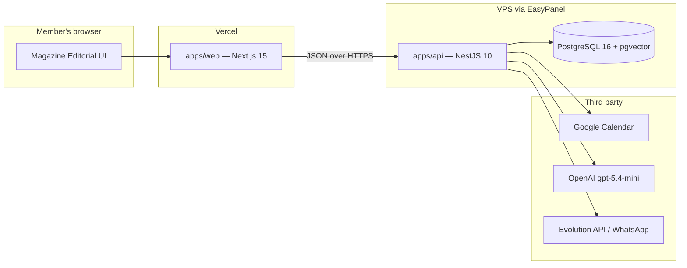
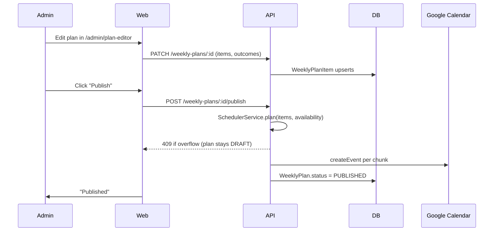

# Architecture

ICS Select is a pnpm + Turborepo monorepo with three applications and three internal packages. The API is NestJS on a Docker container; the web app is Next.js 15 on Vercel; the docs (this site) is Nextra on Vercel.

## The high-level picture



The web app talks to the API over HTTPS (`https://ics-api.daviduarte.com.br`). Authentication is short-lived JWTs in httpOnly cookies with rotating refresh tokens; Google OAuth tokens are encrypted with AES-256-GCM before they hit the database, so the database alone cannot impersonate a user against Google Calendar.

## The monorepo

```
ics-select/
├── apps/
│   ├── api/              NestJS 10, the backend
│   ├── web/              Next.js 15, the product UI
│   └── docs/             Nextra, this docs site
├── packages/
│   ├── prisma/           schema.prisma + generated client
│   └── shared/           Compiled tsc → dist (CommonJS) for runtime consumption
├── docs/                 Spec, design system, ideas (raw)
└── scripts/
```

A few things are worth knowing before you touch any of this:

- The `shared` package builds to `dist/` as CommonJS because `apps/api` resolves it at runtime, not via ts-jest. Jest in the API bypasses this via a `moduleNameMapper` so unit tests do not need a pre-build, but the compiled image does need `dist/` to exist.
- The `prisma` package's runtime entry points straight at `generated/client/index.js`. There is no TS wrapper to compile.
- Tailwind in `apps/web` reaches into pnpm's flat store at `node_modules/.pnpm/@heroui+theme@*/...` because pnpm does not put HeroUI at the conventional path. If you ever break this, HeroUI modals silently render without their styles and unit tests will not catch it.

## Backend modules

The NestJS API is organized one folder per feature under `apps/api/src/`:

```
auth/                  Google OAuth, JWT issuance, refresh rotation
users/                 User CRUD, profile, role assignment
cycles/                Cycle lifecycle + the active-cycle resolver
library/               Acervo CRUD, search (tsvector + topic match)
availability/          Member declared weekly minutes
weekly-plans/          Draft + published plans, items, outcomes
scheduler/             The greedy chunker that packs items into days
classes/               In-person class sessions + attendance
admin-dashboard/       Cohort metrics, ranking, cockpit, triage
ai/                    OpenAI provider + the four use cases
whatsapp/              Evolution API integration, WhatsappLog
notifications/         Reminders (cron) + "stuck" alerts
google-calendar/       Event create/update/delete via the user's tokens
me/                    Member-facing endpoints (home, plan, cohort)
reports/               Markdown cycle reports
privacy/               LGPD export / delete
health/                Liveness probe (public)
```

Every controller is authenticated by default. `AppModule` registers `JwtAuthGuard` and `RolesGuard` as `APP_GUARD` providers; opt-out is `@Public()` (only `/health` and the OAuth callback) and admin-only is `@Roles('ADMIN')`. The current JWT user is pulled with `@CurrentUser()`.

## The weekly-plan flow, end to end

This is the critical path of the product. It is worth walking through.



The scheduler is a greedy chunker (`apps/api/src/scheduler/phase1.ts`). It splits each item by its `preferredSessionMinutes` and packs the chunks day by day into the member's declared budget. The older size-desc FFD plus branch-and-bound was removed because it reordered items in ways that broke the admin's pedagogical sequence. The new rule: `WeeklyPlanItem.order` is a hard constraint, and the scheduler prefers under-fill to reorder.

Google Calendar events carry an `ICS ID: <planId>/<itemId>` marker in the description. That marker is the single way downstream cleanup, the WhatsApp reminder cron, and event-update logic find the right event. If you ever change the marker format, every previously-published plan loses its handle.

## The library and pgvector

Library search is **lexical**, not semantic. Tsvector with English stemming, weighted across title, description, tags, source URL, and a service-side topic-label match. The `tsvector` column is maintained by a Postgres trigger, not from app code.

The pgvector extension and the `embedding vector(1536)` column are still in the schema, but as of 2026-05-08 nothing writes to them. The OpenAI embedding generation was removed from `LibraryService` and the seed because no `SELECT` ever consumed them. The column is nullable so legacy rows keep their values, and the ivfflat index is kept in case a future semantic-search feature wants the column back.

Items are tagged many-to-many with topics (`LibraryItemTopic` join table). Exactly one row per item is `isPrimary: true`. Cross-topic items count toward **every** topic they cover when computing coverage percentages, so a Fireship "five wild data structures" video tagged with `tree`, `array`, and `databases` increments all three.

Per-topic pedagogical order is on the join row, not the item. The same item can be early in the `tree` ladder and late in the `array` ladder, because a video plays a different role in each topic's sequence.

## The engagement score

The engagement score is the **single source of truth** for "how engaged is this member" across both the admin cockpit and the member-facing cohort ranking. It is computed in `apps/api/src/admin/cockpit/engagement-score.ts` and the inputs are batched per cohort in `engagement-inputs.ts` via one `$queryRawUnsafe` with LEFT JOINs.

The full table is in [Product tour](/product-tour). The implementation rule worth remembering: when calling `computeEngagementInputsForCohort`, the `cycleStart` must be Monday-normalized via `mondayUTC(cycle.startsAt)`. Passing a raw `startsAt` that is not a Monday skews `daysActive` and `daysElapsed` by up to six days.

## The AI module

Four use cases (`draft-plan`, `brief-plan`, `diagnose`, `chat`) all go through `OpenAiChatProvider` in `apps/api/src/common/openai/`. Every call records tokens and USD cost to `AiGeneration` via `UsageLoggerService`. The chat surface streams via Server-Sent Events; the frontend reads the `text/event-stream` manually with `fetch` plus a `ReadableStream`, not via TanStack Query. See [AI features](/ai) for the full picture.

## What got removed

A few earlier-phase pieces were ripped out and are worth flagging so a reader does not search for them:

- The 3D and 2D maps. The "learning path" metaphor was replaced by a daily list plus a cohort feed. Less novel, much more honest about what helps a student study.
- The `StudySession` entity. Progress lives on `WeeklyPlanItem.outcome`, and Google Calendar events are the source of truth for time blocks.
- Three separate fields (`status`, `stuck`, `difficultyRating`) on items, unified as the single `ItemOutcome` enum.
- The TTFV (Time To First View) engagement criterion. It was bugged in practice and low-signal. The 10 points it carried were redistributed across the other six criteria.

If your instinct after reading this is "what does the directory tree actually look like?", run `tree -L 3 -I node_modules` in the repo root. The structure is intentional and shallow.
