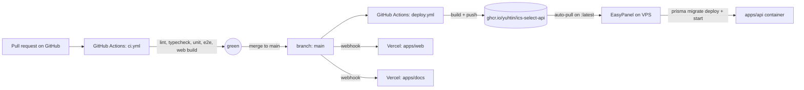

# Deployment

ICS Select has a small but deliberate deploy pipeline. The API runs in a Docker container on a VPS behind EasyPanel; the web is on Vercel; the docs site is also on Vercel. GitHub Actions handles CI and image publishing. Nothing else.

## The high-level flow



There is no SSH in the pipeline. The CI publishes the image to GHCR; EasyPanel watches `:latest` and pulls on its own. This is intentional: SSH-based deploys leak secrets, drift, and break silently. A container registry plus an auto-pull is the smallest reliable surface.

## CI: `.github/workflows/ci.yml`

The pipeline runs on every PR and every push:

1. **Lint** across all packages (Turbo).
2. **Typecheck** across all packages.
3. **Unit tests** for the API (Jest + Supertest) and `shared` (Vitest), with a Postgres + pgvector service container available.
4. **e2e tests** for the API (real `AppModule`, mocked Prisma `$connect`).
5. **Web build** to catch Next.js compile failures.
6. **Playwright** snapshot tests against the dev server. Failed snapshots upload the `playwright-report` artifact for download.

Concurrency group: `ref + sha`, so a new push on the same branch cancels the in-flight run.

## Deploy: `.github/workflows/deploy.yml`

Runs on `workflow_run` after a successful CI on `main`. Builds the multi-stage Docker image and pushes two tags to GHCR:

- `ghcr.io/yuhtin/ics-select-api:<short-sha>` (immutable, used for rollback)
- `ghcr.io/yuhtin/ics-select-api:latest` (what EasyPanel pulls)

The Dockerfile is multi-stage: a `deps` stage installs everything, a `build` stage runs the build and does `pnpm deploy --prod /out`, and the runtime stage is Alpine with the Prisma CLI installed globally and the entrypoint:

```sh
#!/bin/sh
set -e
prisma migrate deploy --schema=/app/node_modules/@ics-select/prisma/prisma/schema.prisma
exec "$@"
```

Default CMD is `node dist/src/main.js`. Any new migration ships itself on the next container start.

## EasyPanel (the VPS side)

The setup is one-time. Once configured, the only thing EasyPanel needs to do is pull `:latest` when a new image lands on GHCR.

1. Create an App pointing at `ghcr.io/yuhtin/ics-select-api:latest`.
2. Add private-registry credentials (a PAT with `read:packages` scope).
3. Create a Postgres service. Use the `pgvector/pgvector:pg16` image, not the stock Postgres one.
4. Optional: create an Evolution API service (WhatsApp reminders).
5. Set the env vars listed in [Contributing](/contributing#environment-variables). `DATABASE_URL` points at the EasyPanel-managed Postgres.
6. Point the domain `ics-api.daviduarte.com.br` at the app. EasyPanel provisions the TLS certificate.

Rollback is "change the image tag to a previous `<short-sha>` and redeploy". The tags persist indefinitely on GHCR.

## Vercel (the web side)

The Vercel project is linked at the **repo root**, not at `apps/web`. The project settings on the Vercel side use:

- **Root Directory:** `apps/web`
- **Source files outside root directory:** enabled (the project depends on `packages/shared` and `packages/prisma`)

`apps/web/vercel.json` overrides install and build to bounce out to the repo root and run pnpm there:

```json
{
  "installCommand": "cd ../.. && pnpm install --frozen-lockfile",
  "buildCommand": "cd ../.. && pnpm --filter shared build && prisma generate && pnpm --filter web build"
}
```

The custom domain is `ics.daviduarte.com.br`. The single required env var is `NEXT_PUBLIC_API_URL=https://ics-api.daviduarte.com.br`.

## Vercel (the docs side)

This site (`apps/docs`) follows the same pattern. Root directory `apps/docs`, source-files-outside-root enabled, build pointed at the repo root. The recommended Vercel project name is `ics-select-docs` and the custom domain is whatever you wire up at the DNS level.

## Database safety

A non-negotiable rule that applies to every workflow that ever touches the database: **production migrations ship via container redeploy, never via a direct `prisma migrate deploy` from a developer laptop**. The entrypoint in the container is the only thing that should ever apply migrations against prod.

The historical reason: the production database is not baselined with `_prisma_migrations`, so `prisma migrate dev` against it hits P3005 and offers to **reset the database**. Confirming that prompt drops every table. This has happened. The contract is encoded in `CLAUDE.md` at the repo root: never run a destructive Prisma verb against the prod URL, never confirm a reset prompt without explicit per-prompt confirmation, and treat any P3005 against prod as a hard stop.

See [Contributing](/contributing#database-safety) for the full rule set when working locally.

## Production URLs

- Frontend: `https://ics.daviduarte.com.br`
- Backend: `https://ics-api.daviduarte.com.br`
- Docs: this site

## Logs and health

- `curl https://ics-api.daviduarte.com.br/health` for liveness.
- EasyPanel's UI for container logs and Postgres shell access.
- Vercel's deployment logs for the web side.
- `/admin/ai-usage` for OpenAI cost tracking inside the product itself.
